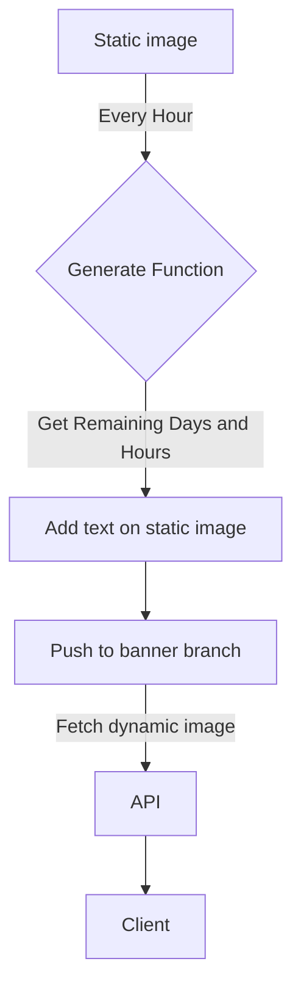

# Hacktoberfest Banner


- This banner is dynamically generated
- It updates every hour

## How to use

You can use this banner from the given link

```md
https://api.codinasion.org/hacktoberfest/banner
```

or use directly in `README.md`

```md

```

```md

```

## How to generate

1. Provide a static banner
2. Calculate the number of days and hours left for Hacktoberfest
3. Add the number of days and hours left to the static banner
4. Save the generated banner
5. Push to different branch ( `optional` )
   - to avoid unnecessary commits
6. Use the generated banner from the raw link or by an API ( `optional` )

## Code

You can find the code for generating the banner in [`generate-banner.py`](generate-banner.py)

For generating the banner every hour and push to different branch, you can use [`banner.yml`](.github/workflows/banner.yml) workflow

## Basic Flow Chart



Learn more about creating this type of flow chart in [this github blog](https://github.blog/2022-02-14-include-diagrams-markdown-files-mermaid/)
